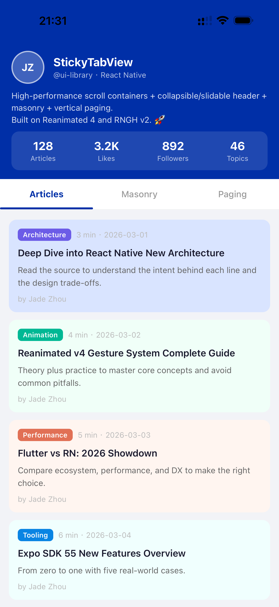

# StickyTabView

> English: [README.md](./README.md)

用于可响应手势的折叠头部、横向分页 Tab、同步滚动与瀑布流布局的 React Native 组件。基于 `react-native-reanimated` 与 `react-native-gesture-handler` 构建。

> **Beta 版本。** 当前的 Reanimated 4 发布线发布在 `next` dist-tag 下。请先在开发环境中使用，并为生产应用锁定一个经过验证的版本。

<p align="center">
  <a href="https://github.com/jadezhouu/sticky-tab-view/releases/download/v2.0.0-beta.0/sticky-tab-view-v2.0.0-beta.0-demo.mp4">
    
  </a>
</p>

<p align="center">
  <a href="https://github.com/jadezhouu/sticky-tab-view/releases/download/v2.0.0-beta.0/sticky-tab-view-v2.0.0-beta.0-demo.mp4">
    观看高清演示视频
  </a>
</p>

## 特性

- **StickyTabView** — 可响应滑动手势的折叠头部 + 横向分页 Tab，带同步滚动位置
- **ElasticScrollView** — 手势驱动滚动容器，支持回弹、分页与头部联动
- **ElasticPullRefreshHeader** — 内置下拉刷新指示器（可通过 `PullRefreshHeaderComponent` 契约自定义）
- **MasonryList** — 高性能瀑布流列表，支持单元复用、分页与多 section

## 环境要求

- **必须使用新架构（Fabric）。** 本库仅面向 React Native 新架构构建；不支持 Paper / 旧架构。
- 开发与工具链需 **Node.js `>=20.19.4`**。
- 本包为 **ESM-only**；不提供 CommonJS 构建。
- 应用必须挂载在 [`GestureHandlerRootView`](#gesture-handler-root-view) 下。
- 必须启用 Worklets Babel 插件。Expo SDK 54 通过 `babel-preset-expo` 配置；React Native Community CLI 项目需显式配置（见 [Babel 配置](#babel-setup)）。

## 安装

```bash
npm install @jadezhou/sticky-tab-view@next
# 或
pnpm add @jadezhou/sticky-tab-view@next
# 或
yarn add @jadezhou/sticky-tab-view@next
```

当 `2.0.0` 发布到 `latest` 后，可省略 `@next` 后缀。

### Peer 依赖

你的应用必须已使用下方所列的兼容 React 与 React Native 版本。请勿用本库的安装命令去升级既有应用的 `react` 或 `react-native` 版本。

对于 Expo SDK 54 项目，请用 Expo 安装兼容的原生 peer：

```bash
npx expo install react-native-gesture-handler react-native-reanimated react-native-worklets
```

对于 React Native Community CLI，请安装所列 peer 范围内的版本，然后重新构建原生应用。你的包管理器可能会自动安装缺失的 peer 依赖；运行前请确认解析出的版本。

| 依赖                           | 要求范围           |
| ------------------------------ | ------------------ |
| `react`                        | `>=19.1.0 <20.0.0` |
| `react-native`                 | `>=0.81.0 <0.82.0` |
| `react-native-gesture-handler` | `>=2.28.0 <2.29.0` |
| `react-native-reanimated`      | `>=4.1.0 <4.2.0`   |
| `react-native-worklets`        | `>=0.5.0 <0.6.0`   |

### 兼容矩阵

本版本支持并针对以下组合进行了验证：

| 依赖                         | 版本               |
| ---------------------------- | ------------------ |
| React                        | 19.1.0             |
| React Native                 | 0.81.x             |
| react-native-gesture-handler | 2.28.x             |
| react-native-reanimated      | 4.1.x              |
| react-native-worklets        | 0.5.x              |
| 架构                         | 仅新架构（Fabric） |

Web/H5 **不属于**发布契约的一部分；它仅作为实验性构建冒烟测试使用（见 [平台支持](#platform-support)）。

### Gesture Handler Root View

在应用根部包裹一次即可。尽量靠近真实应用根部，使所有手势关系都挂载在同一个根视图下。

```tsx
import { GestureHandlerRootView } from 'react-native-gesture-handler';

export default function App() {
  return (
    <GestureHandlerRootView style={{ flex: 1 }}>
      <MyScreen />
    </GestureHandlerRootView>
  );
}
```

## Babel 配置

必须启用 Worklets Babel 插件，worklet 才能运行。插件缺失或配置过期可能导致诸如 `Failed to create a worklet` 的错误。

**Expo SDK 54** — `babel-preset-expo` 默认已包含 Worklets 插件。标准 Expo 配置无需额外插件项：

```js
module.exports = {
  presets: ['babel-preset-expo'],
};
```

如果你的 Expo 项目有自定义 Babel 配置，请确认插件仍处于启用状态；仅当 preset 未提供时才手动添加。

**React Native Community CLI** — 保留现有 preset，并添加插件：

```js
module.exports = {
  presets: ['module:@react-native/babel-preset'],
  plugins: ['react-native-worklets/plugin'],
};
```

如果你的项目本就不用 Expo，请**不要**添加 `babel-preset-expo` —— 本库本身不依赖 Expo。

安装或升级原生依赖后，需重新构建原生应用。仅修改 `babel.config.js` 后，需清缓存重启 Metro：

- **Expo** — `npx expo start -c`；原生依赖变更后，用 `npx expo run:ios` 或 `npx expo run:android` 重新构建。
- **React Native CLI** — 用 `npx react-native start --reset-cache` 重启 Metro；原生依赖变更后重新构建原生二进制。
- 仅做 Fast Refresh / Metro reload 在 Babel 配置变更后是不够的。

## 快速开始

一个最小屏幕示例。假设应用根部已如上所示包裹 `GestureHandlerRootView`。

```tsx
import React, { useCallback } from 'react';
import { View, Text } from 'react-native';
import { StickyTabView, ElasticScrollView } from '@jadezhou/sticky-tab-view';
import type { TOnRefreshParam } from '@jadezhou/sticky-tab-view';

export default function MyScreen() {
  const renderHeader = useCallback(
    () => (
      <View style={{ paddingTop: 60 }}>
        <Text>My Collapsible Header</Text>
      </View>
    ),
    [],
  );

  const renderTab = useCallback((tab: number) => {
    switch (tab) {
      case 0:
        return (
          <ElasticScrollView
            bounces
            onRefresh={(refresh: TOnRefreshParam) => {
              setTimeout(() => refresh.endRefresh(), 1000);
            }}
          >
            <Text>Tab 1 Content</Text>
          </ElasticScrollView>
        );
      case 1:
        return (
          <ElasticScrollView>
            <Text>Tab 2 Content</Text>
          </ElasticScrollView>
        );
      default:
        return null;
    }
  }, []);

  return (
    <StickyTabView
      tabCount={2}
      renderHeader={renderHeader}
      renderTab={renderTab}
      tabBarHeight={50}
    />
  );
}
```

## API

### StickyTabView

带共享可折叠头部的分页容器。从头部区域开始的纵向拖动也会驱动当前 Tab 的内容滚动与头部折叠，让 TabBar 上下区域保持连续的滚动体验。组件同时通过 `ref` 暴露命令式句柄。

| Prop                  | 类型                                    | 默认值   | 说明                                           |
| --------------------- | --------------------------------------- | -------- | ---------------------------------------------- |
| `tabCount`            | `number`                                | _(必填)_ | 横向 Tab 数量                                  |
| `renderHeader`        | `() => ReactElement`                    | _(必填)_ | 渲染可折叠头部                                 |
| `renderTab`           | `(tab: number) => ReactElement \| null` | _(必填)_ | 渲染每个 Tab 的内容                            |
| `renderTabBar`        | `(x, ys, current) => ReactNode`         | —        | 自定义 Tab 栏；参数为 Reanimated shared values |
| `lazy`                | `boolean`                               | `false`  | 懒加载 Tab（仅在可见时渲染）                   |
| `lazyPreloadDistance` | `number`                                | `0`      | 启用 `lazy` 时预加载的相邻 Tab 数量            |
| `current`             | `number`                                | `0`      | 初始 Tab 索引；挂载后不再是受控 prop           |
| `tabBarHeight`        | `number`                                | `50`     | 渲染出的 Tab 栏实际高度（单位 point）          |
| `headerOffset`        | `number`                                | `0`      | 从可折叠头部预留的高度（例如固定悬浮层）       |

`tabBarHeight` 必须与自定义 Tab 栏的高度一致。挂载后切换 Tab，用 `ref.current?.setTab(index)`；之后修改 `current` 不会控制激活的 Tab。

句柄方法：

```tsx
const ref = useRef<StickyTabViewHandle>(null);
ref.current?.setTab(1); // 编程方式切换 Tab
```

### ElasticScrollView

手势驱动的滚动容器。与 React Native 的 `ScrollView` 类似，它渲染调用方提供的 children，且**不会**对任意子元素做虚拟化。适合有界内容以及吸顶头部、分页、刷新与加载更多交互。对于长而不受约束的列表，请优先使用 `MasonryList`。

| Prop                     | 类型                                    | 默认值                     | 说明                                   |
| ------------------------ | --------------------------------------- | -------------------------- | -------------------------------------- |
| `bounces`                | `boolean \| "vertical" \| "horizontal"` | `"vertical"`               | 回弹方向                               |
| `pagingEnabled`          | `boolean \| "vertical" \| "horizontal"` | `false`                    | 吸附分页                               |
| `scrollEnabled`          | `boolean \| "vertical" \| "horizontal"` | `"vertical"`               | 启用/禁用滚动                          |
| `directionalLockEnabled` | `boolean`                               | `true`                     | 锁定单一滚动方向                       |
| `decelerationRate`       | `number`                                | `0.998`                    | 减速系数                               |
| `onRefresh`              | `(refresh: TOnRefreshParam) => void`    | —                          | 下拉刷新回调                           |
| `onEndReached`           | `() => Promise<boolean \| undefined>`   | —                          | 加载更多回调；resolve 是否还有更多内容 |
| `refreshing`             | `boolean`                               | `false`                    | 受控刷新状态                           |
| `loadingMore`            | `boolean`                               | `false`                    | 加载更多指示器                         |
| `loadFinished`           | `boolean`                               | `false`                    | 所有内容已加载                         |
| `endReachedThreshold`    | `number`                                | `2000`                     | 距末尾多远时判定触发加载更多           |
| `pageSize`               | `{ width: number; height: number }`     | `{ width: 0, height: 0 }`  | 分页步长；0 表示使用测量的容器尺寸     |
| `pullRefreshHeader`      | component                               | `ElasticPullRefreshHeader` | 自定义下拉刷新头部组件                 |
| `loadMoreFooter`         | component                               | 内置 footer                | 自定义加载更多 footer 组件             |

句柄方法（通过 `ref`）：

```tsx
const ref = useRef<ElasticScrollViewHandle>(null);
await ref.current?.scrollTo({ x: 0, y: 0 }, true); // 滚动到偏移量，可选动画
```

`scrollTo` 与 `scroll` 均返回 `Promise<void>`。该组件也接受标准的 React Native `ViewProps` 及高级属性，如 `contentInsets`、`contentOffset` 与滚动生命周期回调；完整定义见 `TElasticScrollViewProps`。

### ElasticPullRefreshHeader

默认下拉刷新指示器。你可以通过 `ElasticScrollView` 的 `pullRefreshHeader` prop 传入自定义 forward-ref 组件；它必须暴露相同的 ref 接口以及一个数值静态 `height`。编写自定义头部时，可从 `TElasticScrollViewProps['pullRefreshHeader']` 推导出接受的组件类型。

### MasonryList

瀑布流列表，使用本库自带的布局缓存与单元复用层。它是本包中的长列表组件，不依赖 FlatList、FlashList 或 LegendList。

必填 props（泛型项类型为 `T`）：

| Prop            | 类型                                            | 说明         |
| --------------- | ----------------------------------------------- | ------------ |
| `onFetch`       | `(page, ctx, signal?) => Promise<TFetchRes<T>>` | 拉取一页数据 |
| `heightForItem` | `(item, index, sectionIndex) => number`         | 每项的高度   |
| `renderItem`    | `(item, index, sectionIndex) => ReactNode`      | 渲染每一项   |

`onFetch` 首次加载时收到 `0`，并带一个可选的 `AbortSignal`；当你的数据客户端支持取消时请遵循该 signal。返回 `items` 或 `sections`（不可同时返回），并用 `hasMore` 控制后续分页。`heightForItem` 必须返回所渲染项的实际高度。

`renderError` 收到 `{ error, phase, retry }`。`phase` 为 `initial`、`refresh` 或 `loadMore`；调用 `retry()` 可重试失败请求。既有的零参数错误渲染器仍然受支持。当异构项布局需单独复用时，可设置项的可选 `reuseType`。

完整 prop 类型见 `TMasonryListProps`。

### 公共类型

`ElasticScrollViewHandle`、`StickyTabViewHandle`、`TDirection`、`TElasticScrollViewProps`、`TFetchContext`、`TFetchRes`、`TItemBase`、`TMasonryErrorInfo`、`TMasonryListProps`、`TMasonryRequestPhase`、`TOnRefreshParam`、`TPanHandler`、`TSectionData`、`TStickyTabViewProps`。

用 `import type` 引入：

```tsx
import type {
  ElasticScrollViewHandle,
  StickyTabViewHandle,
  TMasonryListProps,
  TStickyTabViewProps,
} from '@jadezhou/sticky-tab-view';
```

## 使用示例

### 下拉刷新

```tsx
<ElasticScrollView
  onRefresh={(refresh: TOnRefreshParam) => {
    loadData().then(() => refresh.endRefresh());
  }}
>
  {/* content */}
</ElasticScrollView>
```

### 分页（加载更多）

`onEndReached` resolve 一个布尔值：`true` 表示还有更多内容，`false`（或 `undefined`）则停止后续请求。数据加载完后设置 `loadFinished`。

```tsx
const [loadFinished, setLoadFinished] = useState(false);

<ElasticScrollView
  loadFinished={loadFinished}
  onEndReached={async () => {
    const hasMore = await loadNextPage();
    if (!hasMore) setLoadFinished(true);
    return hasMore;
  }}
>
  {/* content */}
</ElasticScrollView>;
```

### 懒加载 Tab

```tsx
<StickyTabView
  lazy
  lazyPreloadDistance={1}
  tabCount={4}
  renderHeader={renderHeader}
  renderTab={renderTab}
/>
```

### 错误处理（MasonryList）

```tsx
<MasonryList
  onFetch={fetchPage}
  heightForItem={heightForItem}
  renderItem={renderItem}
  renderError={({ error, phase, retry }) => (
    <View>
      <Text>Failed to load ({phase}).</Text>
      <Button title="Retry" onPress={retry} />
    </View>
  )}
/>
```

## 平台支持

| 功能           | iOS | Android | Web                |
| -------------- | --- | ------- | ------------------ |
| 吸顶头部 + Tab | ✅  | ✅      | 实验性（构建冒烟） |
| 下拉刷新       | ✅  | ✅      | 实验性（构建冒烟） |
| 分页           | ✅  | ✅      | 实验性（构建冒烟） |
| 瀑布流布局     | ✅  | ✅      | 实验性（构建冒烟） |

本库的支持目标是 iOS 与 Android。Expo example 保留了实验性的 `react-native-web` 构建冒烟，但浏览器交互、手势与性能兼容性不属于发布契约。

## 故障排查

### `Failed to create a worklet` 或 Worklets 版本不匹配

确认应用使用兼容矩阵中的 peer 版本、Worklets Babel 插件已启用，并清缓存重启 Metro。安装或升级 `react-native-reanimated` 或 `react-native-worklets` 后需重新构建原生应用。

### 手势无响应

确认 `GestureHandlerRootView` 包裹了应用根部，且所有相关手势都挂载在同一个根视图下。

### CommonJS 或旧版 Jest 工具无法导入本包

本包为 ESM-only。请将消费方工具链配置为可解析 ESM，或使用兼容 ESM 的测试与构建方案。

## Reanimated 3 兼容线

本仓库当前发布的是 **Reanimated 4** 线（`2.x`）。计划未来推出 **Reanimated 3** 兼容线（`1.x`），发布在 `reanimated3` / `reanimated3-next` dist-tag 下。它**尚未可用** —— 请勿假设本版本支持 Reanimated 3。

## 开发

```bash
# 安装依赖
pnpm install

# 运行类型检查
pnpm typecheck

# 运行测试
pnpm test

# 构建 JS + 类型声明到 dist/
pnpm build

# 启动 example 应用
cd example && pnpm start
```

贡献指南见 [CONTRIBUTING.md](./CONTRIBUTING.md)。

## 许可证

[MIT](./LICENSE)
